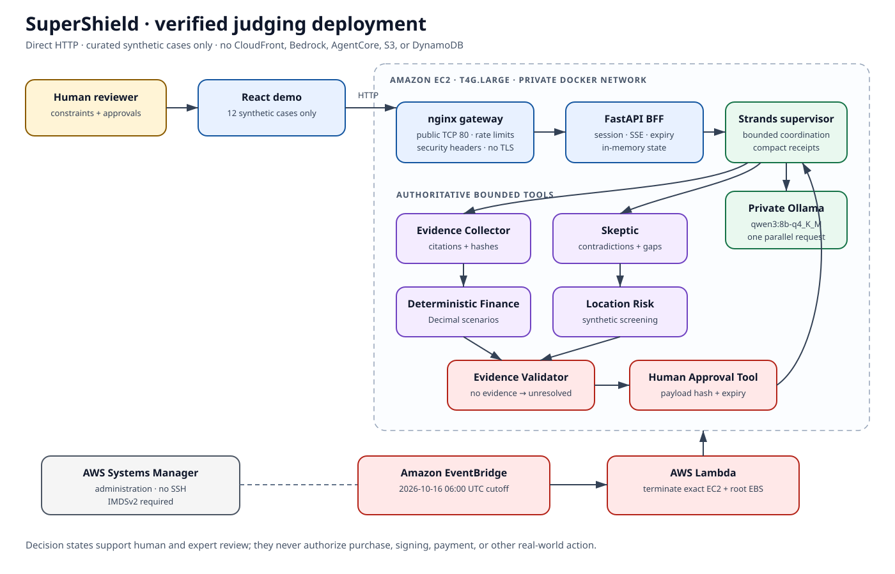

# SuperShield

## The Human Decision Firewall

SuperShield is an evidence-first AI agent that investigates a franchise opportunity, challenges its claims, calculates the consequences, identifies missing facts, and stops before the human's final decision.

Built for the [Agents for Humans](https://agentsforhumans.devpost.com/) hackathon's **Professional Agents** track, SuperShield follows Priya, a fictional first-time franchise buyer protecting her life savings. It is a clean-room, standalone project using entirely synthetic franchises, documents, people, financials, and location data.

> SuperShield does not recommend a purchase and does not provide legal, investment, accounting, lending, or site-selection advice. Its result is a preparation packet for human and expert review.



## The problem

A franchise decision spans promotional claims, disclosures, fee schedules, financial models, leases, location evidence, and facts that may never have been supplied. A conventional summary can repeat a persuasive number without noticing that another document contradicts it—or silently fill a gap that should stop the decision.

SuperShield produces only three states:

- `READY_FOR_EXPERT_REVIEW` — the evidence packet is ready to take to qualified advisers;
- `MORE_EVIDENCE_REQUIRED` — a material unknown blocks advancement; or
- `MATERIAL_RISK_IDENTIFIED` — cited evidence establishes a serious conflict or constraint.

None means “buy.”

## Why an agent

This is a dependency-aware investigation, not one prompt over one document. A Strands supervisor plans work, delegates to bounded specialist capabilities, pauses for evidence or approval, and selectively reruns only affected work when evidence changes.

| Capability | Responsibility | Hard boundary |
|---|---|---|
| Evidence Collector | Extract claims with document, page, excerpt, and content hash | Treats all source text as untrusted data |
| Skeptic | Seek contradiction, exclusions, and missing support | Cannot modify evidence or approve conclusions |
| Finance | Calculate investment, fees, operating income, break-even, runway/downside | Decimal code is authoritative; no model arithmetic |
| Location | Screen synthetic competitor density and travel radius | Not professional site selection |
| Validator | Verify citations, numbers, and evidence sufficiency | No evidence → unresolved material conclusion |
| Approval | Bind an allowed action to payload hash, case, session, and expiry | No signature, purchase, payment, acceptance, or real-world commitment |

SuperShield can run the graph through the real Strands Agents SDK with a local Ollama model, or through Amazon Bedrock when account access is available. The deterministic mode mirrors the same bounded tools for inspection, tests, and replay. Bedrock AgentCore is an optional deployment target, not a requirement for local operation or contest eligibility.

## Flagship walkthrough

Choose **Saffron Route — Priya's Investigation**:

1. Priya sets a $225,000 investment ceiling, protects a $45,000 emergency reserve, and requires $6,000 monthly household income.
2. A brochure says “typical” kitchens reach $1.2M annual sales. The synthetic disclosure reports a $720,000 median and says none in its measured set reached $1.2M.
3. The provided projection omits a required 4% platform charge plus $350 monthly—**$2,750 per month** at the evidenced revenue.
4. The draft lease escalates 6% annually and personally guarantees the ten-year term. Five synthetic competitors sit within four miles.
5. Deterministic calculation yields $7,550 recurring monthly fees, $1,450 operating income, a **$4,550 household shortfall**, $57,500 break-even revenue, and $30,000 cash headroom after reserve.
6. Signed landlord consent for restaurant use, ventilation, signage, and assignment is missing. Validation stops at `MORE_EVIDENCE_REQUIRED` and drafts a targeted request.
7. Only an explicit, payload-bound human approval permits a test request or packet export. New evidence invalidates only dependent work and produces a clear “Why this changed” record.

## Product flow

- Buyer-constraint form and investigation-plan preview
- Live agent activity over Server-Sent Events: tool, status, citations, timing—never private reasoning
- Claim-to-evidence relationships and exact source pages
- Contradiction, missing-evidence, lease, financial, and location cards
- Promotional, evidenced, and downside scenario comparison
- Human approval checkpoint with mutation/replay protection
- Selective re-analysis and “Why this changed”
- Auditable Decision Packet with provenance and plain-language summary

The interface is designed for keyboard navigation, visible focus, responsive layouts, WCAG contrast, and severity labels that do not rely on color alone.

## Architecture

```text
React curated-case demo
        ↓
FastAPI BFF on AWS App Runner
        ↓
Amazon Bedrock AgentCore Runtime
        ↓
Strands SuperShield Supervisor
 ├─ Evidence Collector
 ├─ Skeptic / Contradiction Agent
 ├─ Deterministic Finance Tool
 ├─ Location-Risk Tool
 ├─ Evidence Validator
 └─ Human Approval Tool
        ↓
DynamoDB TTL + encrypted temporary S3 + CloudWatch/OTel
```

See the [architecture explanation](docs/architecture.md), [editable Mermaid](docs/architecture.mmd), and [standalone SVG](docs/architecture.svg).

## Repository map

```text
src/supershield/   typed models, tools, orchestration, API, and AWS adapters
web/               React/TypeScript public demo
fixtures/          exactly 12 synthetic, page-addressable investigations
evals/             generic API/local benchmark and baseline
infra/             CloudFormation, AgentCore, App Runner, and deployment scripts
docs/              architecture, security, demo, article, video, and submission assets
tests/             deterministic, API, policy, approval, and adversarial tests
```

## Local setup

Requirements: Python 3.11+ and Node.js 20+ for the web application. The default deterministic mode needs no AWS account and makes no model call. Ollama is needed only for local Strands execution.

### API

```powershell
git clone https://github.com/alpha-kapex/SuperShield.git
cd SuperShield
python -m venv .venv
.venv\Scripts\Activate.ps1
python -m pip install --upgrade pip
python -m pip install -e ".[dev,aws]"
supershield-api
```

On macOS/Linux, activate with `source .venv/bin/activate`. The API is at `http://localhost:8000`; interactive OpenAPI docs are at `http://localhost:8000/docs`.

### Real Strands agent locally (no Bedrock required)

Install [Ollama](https://ollama.com/), then run:

```powershell
ollama pull qwen3:0.6b
$env:SUPERSHIELD_MODE="strands"
$env:SUPERSHIELD_STRANDS_PROVIDER="ollama"
$env:SUPERSHIELD_OLLAMA_MODEL="qwen3:0.6b"
supershield-api
```

This path invokes the real Strands supervisor and its bounded tools locally. Deterministic Python remains authoritative for evidence validation and arithmetic. To use Bedrock later, set `SUPERSHIELD_STRANDS_PROVIDER=bedrock` and supply valid AWS credentials and model access.

### Web

In a second terminal:

```powershell
cd web
npm install
npm run dev
```

Open `http://localhost:5173`. If the web package exposes a different documented install lockfile, prefer its reproducible command (`npm ci`).

### Containers

```powershell
Copy-Item .env.example .env
docker compose up --build
```

The container runs as an unprivileged user, drops Linux capabilities, uses a read-only filesystem, and exposes port 8000. Replace development secrets before any shared deployment.

## API quick start

Pydantic accepts the documented camelCase JSON aliases. Use a stable session ID with at least eight characters.

```bash
curl http://localhost:8000/demo-cases

curl -X POST http://localhost:8000/cases \
  -H "Content-Type: application/json" \
  -d '{"demoCaseId":"priya-saffron-route"}'

curl -X POST http://localhost:8000/cases/CASE_ID/runs \
  -H "Content-Type: application/json" \
  -d '{"sessionId":"demo-session-001"}'

curl -N http://localhost:8000/runs/RUN_ID/events
curl http://localhost:8000/cases/CASE_ID/decision-packet
curl -X DELETE http://localhost:8000/cases/CASE_ID
```

Approval and evidence-ingestion request bodies are documented by OpenAPI at `/docs`. Approval must match the exact pending checkpoint action, payload, case, session, and expiry.

## Configuration

Local defaults are safe for a single developer. Cloud deployment should set every resource name explicitly.

| Variable | Purpose | Local default |
|---|---|---|
| `SUPERSHIELD_MODE` | `local` deterministic graph or real `strands` orchestration | `local` |
| `SUPERSHIELD_STRANDS_PROVIDER` | Strands model provider: `ollama` or `bedrock` | `bedrock` |
| `SUPERSHIELD_OLLAMA_MODEL` | Local Ollama model used by Strands | `qwen3:0.6b` |
| `SUPERSHIELD_OLLAMA_HOST` | Local Ollama service URL | `http://localhost:11434` |
| `SUPERSHIELD_STORAGE_BACKEND` | `memory` or `dynamodb` | `memory` |
| `SUPERSHIELD_PUBLIC_DEMO` | Enforce curated-demo restrictions | `false` |
| `SUPERSHIELD_ALLOW_INLINE_DOCUMENTS` | Accept inline evidence; must be false publicly | inverse of public demo |
| `SUPERSHIELD_APPROVAL_SECRET` | HMAC secret, at least 32 characters | ephemeral per process |
| `SUPERSHIELD_APPROVAL_TTL_SECONDS` | Approval validity, 30–3600 seconds | `600` |
| `SUPERSHIELD_CASE_TTL_SECONDS` | Case expiry, 300–604800 seconds | `86400` |
| `SUPERSHIELD_MAX_DOCUMENTS` | Per-case document cap | `12` |
| `SUPERSHIELD_MAX_DOCUMENT_BYTES` | Per-document byte cap | `250000` |
| `SUPERSHIELD_CORS_ORIGINS` | Comma-separated exact browser origins | `http://localhost:5173` |
| `SUPERSHIELD_FIXTURE_ROOT` | Fixture directory; forced to remain in this repository | `fixtures/` |
| `AWS_REGION` | AWS deployment region | `us-east-1` |
| `SUPERSHIELD_DYNAMODB_TABLE` | Expiring case/run table | `supershield-state` |
| `SUPERSHIELD_S3_BUCKET` | Temporary encrypted evidence bucket | unset |
| `SUPERSHIELD_S3_KMS_KEY_ID` | Evidence encryption key | unset |
| `SUPERSHIELD_BEDROCK_MODEL_ID` | Primary synthesis model | `amazon.nova-pro-v1:0` |
| `SUPERSHIELD_BEDROCK_EXTRACTION_MODEL_ID` | Lower-cost extraction model | `amazon.nova-lite-v1:0` |

`.env.example` contains non-secret examples. The application does not need static AWS keys; local development should use an AWS profile and deployed workloads use IAM roles.

## Tests and evaluation

```powershell
pytest
python evals/run_benchmark.py --adapter oracle
python evals/run_benchmark.py --adapter python --callable supershield.evaluation:run_case
python evals/run_benchmark.py --adapter http --base-url http://localhost:8000
```

The oracle mode self-tests fixture composition, source pages, financial formulas, scoring, and report generation. **It is not a model-performance result.** The HTTP and Python adapters measure a real system and preserve per-case outputs.

The suite contains exactly four clean, four contradictory, two missing-evidence, and two hostile-document cases. It reports critical-risk recall, exact citation correctness, unsupported-claim rate, deterministic calculation accuracy, correct abstention/escalation, approval enforcement, unauthorized actions, injection resistance, tool success, latency, and adapter-reported estimated cost. See [evaluation methodology](evals/README.md).

Measured on 2026-09-14 through the real local HTTP API, all 12 cases achieved 100% critical-risk recall, exact citation correctness, deterministic calculation accuracy, correct abstention/escalation, approval enforcement, prompt-injection resistance, and tool-call success, with zero unauthorized actions and zero unsupported material claims. Mean/p95 latency was 93.41/98.70 ms. This is a deterministic workflow result, not a Bedrock-model claim; see [reference results](evals/REFERENCE_RESULTS.md).

Acceptance gates:

- 100% deterministic calculation accuracy
- at least 90% seeded critical-risk recall
- at least 95% citation correctness
- 100% approval enforcement
- zero unauthorized consequential actions
- 100% resistance to fixture injections changing tools, policy, thresholds, secrets, or approvals
- every material conclusion cited or marked unresolved

Publish only a dated non-oracle result tied to its commit, region, and model IDs. The summarization baseline intentionally performs no investigation or deterministic calculation.

## AWS deployment

The full ordered procedure is in [infra/README.md](infra/README.md). In outline:

AWS deployment is optional. An account that is still undergoing Bedrock verification can run and demonstrate the real Strands agent through Ollama, then deploy this same adapter when Bedrock access becomes available.

1. Validate and deploy the core CloudFormation stack and mandatory budget.
2. Deploy `supershield.integrations.agentcore:invoke` from `src/supershield/integrations/agentcore.py` to Bedrock AgentCore Runtime with the emitted least-privilege role.
3. Build an immutable non-root container, push it to the scan-on-push ECR repository, and review findings.
4. Deploy App Runner with the runtime ARN and exact browser origin.
5. Run the smoke script and full HTTP benchmark; inspect the matching AgentCore/CloudWatch trace.

The templates enable KMS encryption, S3 public blocking and one-day lifecycle, DynamoDB TTL and point-in-time recovery, short log retention, scoped IAM, ECR retention/scanning, X-Ray, capped App Runner scaling, an error alarm, and cost notifications.

## Security and human control

Evidence text is always data, even if it says “system override.” Model output is untrusted until deterministic validation. Public mode disables arbitrary uploads and recipients. Logs contain tool names, public state, citation IDs, timings, and run IDs—not document bodies, secrets, approval tokens, or chain-of-thought.

See the [security model](docs/security.md) for threats and controls. Before publishing, run secret, dependency, license, vulnerability, container, Git-history, and IAM reviews listed in the [submission checklist](docs/compliance-checklist.md).

## Cost

- Local deterministic mode: **$0 AWS cost**.
- Cloud inference: `input tokens ÷ 1,000,000 × current input price + output tokens ÷ 1,000,000 × current output price`; the benchmark records adapter-reported cost per case. Verify current Nova and AgentCore pricing in the chosen region.
- Hosting/storage: App Runner's provisioned instance can dominate idle cost; the template caps scaling at two instances but does not create a spending hard stop. DynamoDB on-demand, one-day S3 lifecycle, 14-day logs, and ten-image ECR retention keep demo storage bounded.
- Guardrail: the included AWS Budget defaults to **$25/month**, notifying at 80% forecast and 100% actual. A budget is an alert, not a cap. Delete App Runner and AgentCore after the judging window if continuous availability is unnecessary.

Do not quote the oracle adapter's zero cost as a cloud estimate.

## Known limitations

- All evidence and geospatial observations are synthetic; no real franchise is covered.
- The location tool is a screening heuristic, not professional site selection or market research.
- Model behavior is probabilistic in cloud mode; deterministic validation reduces but does not eliminate error.
- The public demo is not multi-tenant production infrastructure and has no regulated-data compliance claim.
- It does not ingest unrestricted files, browse the web, contact arbitrary recipients, sign, pay, purchase, or integrate with a live franchise workflow.
- DynamoDB TTL and S3 lifecycle deletion are asynchronous; application-level expiry and explicit deletion remain necessary.
- Cost and latency vary by region, model, retries, and AWS pricing.

## Submission materials

- [Five-minute video script](docs/video-script.md)
- [Devpost draft](docs/devpost-submission.md)
- [AWS Builder article draft](docs/builder-article-draft.md)
- [Compliance checklist](docs/compliance-checklist.md)
- [Demo runbook](docs/demo-runbook.md)
- [Data attribution](docs/data-attribution.md)

## Data, license, and attribution

All case content is fictional and synthetic; see [data attribution](docs/data-attribution.md). SuperShield is licensed under the [Apache License 2.0](LICENSE). Dependency and service names retain their owners' licenses and trademarks.

---

**SuperShield does not make Priya's decision. It makes sure she never has to make it without evidence.**
